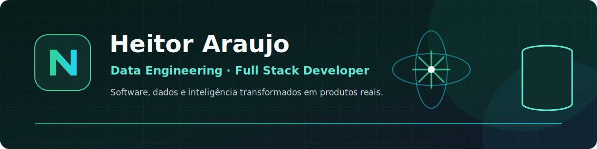

  

 

  
  

## Sobre mim

Sou **Heitor Araujo**, desenvolvedor Full Stack e profissional de Engenharia de Dados. Gosto de transformar ideias em produtos completos: da interface e APIs até pipelines, modelagem de dados, testes e automação.

- Construo aplicações com **React, TypeScript, Node.js e Python**
- Trabalho com dados usando **Databricks, PySpark, Delta Lake e PostgreSQL**
- Tenho interesse em **GenAI, arquitetura de software, segurança e qualidade**
- Busco oportunidades para colaborar em produtos que conectem tecnologia e impacto real

## Projetos em destaque

<table>
  <tr>
    <td width="50%" valign="top">
      <h3>💚 <a href="https://github.com/PRgVVheitor/nexaflow">NexaFlow</a></h3>
      
Plataforma full-stack para finanças pessoais e produtividade, com inteligência financeira, Taskly e autenticação segura.

      
<strong>Destaques:</strong> cookies HttpOnly, TanStack Query, Prisma, PostgreSQL, Docker, CI/CD e testes E2E.

      

        
        
        
      

    </td>
    <td width="50%" valign="top">
      <h3>🏗️ <a href="https://github.com/PRgVVheitor/projeto-engenharia-dados-olist">Pipeline Olist</a></h3>
      
Pipeline de dados ponta a ponta no Databricks usando arquitetura medalhão para transformar dados brutos em informação analítica.

      
<strong>Destaques:</strong> Bronze, Silver e Gold, PySpark, Delta Lake, qualidade de dados e orquestração com Databricks Jobs.

      

        
        
        
      

    </td>
  </tr>
  <tr>
    <td width="50%" valign="top">
      <h3>🤖 <a href="https://github.com/PRgVVheitor/Gen-ai">Agente GenAI para E-commerce</a></h3>
      
Agente que converte perguntas em linguagem natural em SQL seguro e devolve análises de um banco de e-commerce.

      
<strong>Destaques:</strong> Gemini 2.5 Flash, FastAPI, descoberta automática de schema e guardrails somente leitura.

      

        
        
        
      

    </td>
    <td width="50%" valign="top">
      <h3>🏀 <a href="https://github.com/PRgVVheitor/rocketlab2026-full-court-jerseys">Full Court Jerseys</a></h3>
      
E-commerce full-stack de camisas da NBA conectado a uma trilha analítica com arquitetura Bronze, Silver e Gold.

      
<strong>Destaques:</strong> React, FastAPI, CRUD completo, dashboard, SQLite, TanStack Query e Databricks.

      

        
        
        
      

    </td>
  </tr>
</table>

## Stack e ferramentas

### Frontend

### Backend e dados

### Engenharia e qualidade

## GitHub em números

  
  

  

## Atualmente explorando

- Engenharia de dados escalável com arquitetura medalhão
- Aplicações full-stack seguras, observáveis e testadas
- Agentes GenAI com guardrails e integração a dados
- Arquiteturas que aproximam software, analytics e decisões de negócio

  

---

  <strong>Aberto a oportunidades em Engenharia de Dados e Desenvolvimento Full Stack.</strong>
   
  Explore meus repositórios e fique à vontade para entrar em contato pelo GitHub.

